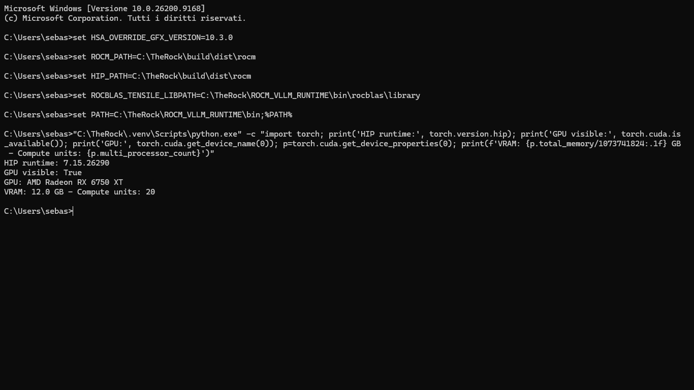
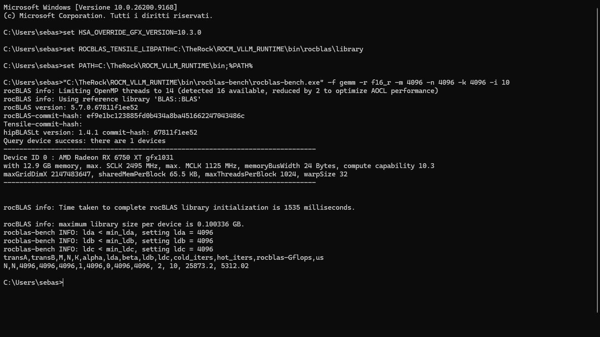
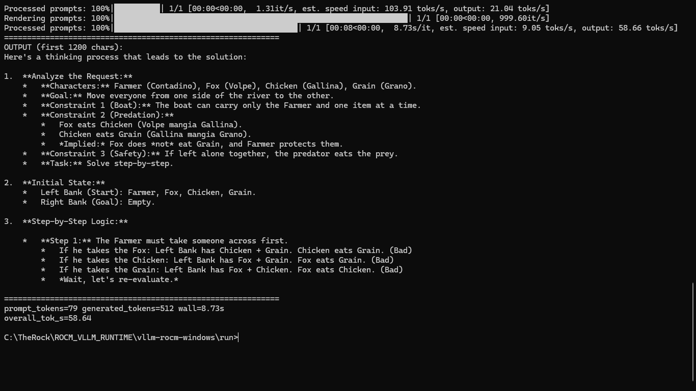
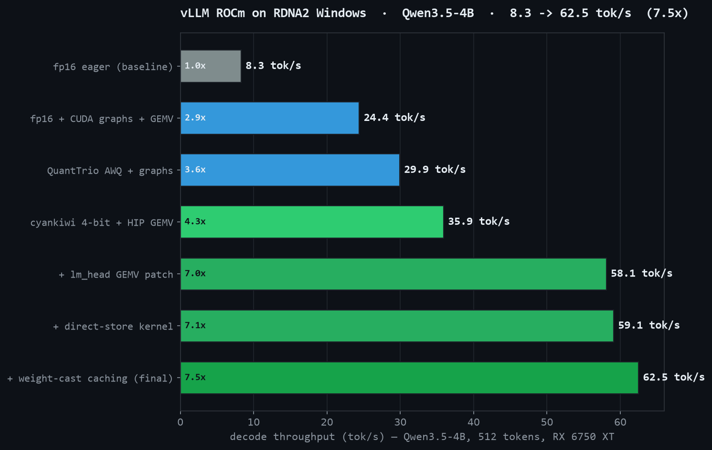

# vllm-rocm-windows-RDNA2-oneclick

> **中文版文档：[README_zh-CN.md](README_zh-CN.md)**

[]()
[]()
[]()
[]()
[]()
[](LICENSE)

Native vLLM + ROCm 7.15 (TheRock) for the whole AMD Radeon RDNA2 family on
Windows — **no WSL2, no NVIDIA, no compiler**. One-click installer, everything
prebuilt, and an OpenAI-compatible chat server that looks and works like the
NVIDIA stack. Code and build pipeline are ready for **RDNA3 (RX 7000)** and
**RDNA4 (RX 9000)** too — those families are experimental until hardware
validation (see [docs/MULTIARCH.md](docs/MULTIARCH.md)).

**Verified on AMD Radeon RX 6750 XT 12 GB (gfx1031) — Windows 11 native — August 2026**
**RX 6800 (gfx1030): testing tracked in [issue #2](https://github.com/sebastianmechno-sys/vllm-rocm-windows-rdna2/issues/2) — confirmation pending**

| Result | Number |
|---|---|
| rocBLAS FP16 GEMM (native bench) | **25 674 Gflops ≈ 26 TFLOPS** |
| vLLM decode, Qwen3.5-4B 4-bit | **~58-62 tok/s** (8.3 → 62.5 = 7.5× optimized) |

<p align="center">⭐ Se ha funzionato lascia una stella, grazie! ⭐</p>

### GPU support matrix

| Family | GPUs | gfx | Override | Status |
|---|---|---|---|---|
| RDNA2 | RX 6400–6950 (desktop + M), Radeon Pro V620 | 1030/1031/1032 | `10.3.1` | ✅ validated on RX 6750 XT; others pending verification ([report yours](https://github.com/sebastianmechno-sys/vllm-rocm-windows-rdna2/issues/new?template=gpu_verification.yml)) |
| RDNA3 | RX 7600–7900 (desktop + M) | 1100/1101/1102 | `11.0.0` | ⚠️ experimental — pipeline ready, archives not published yet |
| RDNA4 | RX 9000 | 1200/1201 | `12.0.0` | ⚠️ experimental — feasibility unconfirmed |

`INSTALL.bat` auto-detects the family; `INSTALL.bat -Variant rdna3` forces one.

---

## Verification — real output from the RX 6750 XT

### 1. ROCm detects the GPU (native Windows process, no WSL)



### 2. Raw GPU power — native rocblas-bench.exe, FP16 GEMM 4096³



### 3. vLLM tuned decode



---

## Requirements

| Item | Requirement |
|---|---|
| OS | Windows 10/11 (Windows 11 recommended; `tar` must support zstd — automatic on Win11) |
| GPU | **AMD RDNA2** — RX 6400 / 6500 / 6600 / 6650 / 6700 / 6750 / 6800 / 6900 / 6950 (all XT/M variants), **Radeon Pro V620** (gfx1030). RDNA3/RDNA4: experimental (see support matrix above). 8+ GB VRAM for the 4B model; 4 GB cards (RX 6400/6500) get a smaller model automatically |
| Driver | AMD Software: Adrenalin Edition (the normal gaming driver) |
| Disk | ~25 GB free on `C:` |
| Internet | only during install (~6 GB: stack ~2.3 GB + model ~3.8 GB) |
| Admin | one UAC click (installer auto-elevates) |

No compiler, no ROCm installer, no manual setup — everything ships prebuilt.

## Quick start (one-click)

1. Download the repository (ZIP or `git clone`). You do **not** need to
   download the release archives (`*.tar.zst`) manually — the installer
   fetches them automatically from the [Releases](https://github.com/sebastianmechno-sys/vllm-rocm-windows-rdna2/releases) tab.
2. **Double-click `INSTALL.bat`** — by default it downloads from this repo's
   releases; pass a GitHub username to use your own fork instead, `-Variant`
   to force a GPU family. It checks GPU + disk, then installs everything it
   does not already have (re-run is always safe and fast):

   | Step | Action |
   |---|---|
   | 1/6 | GPU family detection (rdna2/rdna3/rdna4, warns on unknown GPUs) + Python 3.11.9 |
   | 2/6 | 4 archives from GitHub Releases → `C:\Python311`, `C:\TheRock`, `C:\vw_*_build` |
   | 3/6 | venv fix + torch self-check |
   | 4/6 | Qwen3.5-4B 4-bit model (skipped if already in HuggingFace cache) |
   | 5/6 | writes `config.bat` (the file to edit to change model later) |
   | 6/6 | verification benchmark |

3. **`CHAT.bat`** → opens the web chat in your browser (starts the model server
   automatically the first time). By default the model answers **directly**
   (`THINKING=0` in `config.bat`); set `THINKING=1` to let the model explain
   its reasoning — with Qwen3.5 the reasoning text then appears inside the
   answer (this template does not split it into a separate field). Tokens
   stream live with a tok/s counter, everything local on your AMD GPU.
4. **`SERVE.bat`** → starts the model server on its own (OpenAI-compatible API
   on `http://127.0.0.1:8000/v1`, like `vllm serve` on NVIDIA). Use it with any
   OpenAI client, or just run `CHAT.bat`.
5. **`VERIFY.bat`** → all 3 verification checks in one run: ROCm GPU detection,
   native rocBLAS FP16 power (**~26 TFLOPS**) and the full 512-token vLLM
   benchmark (**~58-62 tok/s**).
6. **`UNINSTALL.bat`** → clean removal of the whole stack when you no longer
   need it (keeps the repo folder itself).

## Benchmarks

| Test | Config | Result |
|---|---|---|
| rocBLAS FP16 GEMM | 4096×4096×4096, rocblas-bench.exe | **25 674 Gflops (≈26 TFLOPS)** |
| vLLM Qwen3.5-4B decode | 512 tok, greedy, CUDA graphs | **59.4 tok/s** (up to 62.5) |
| Optimization progression | eager fp16 baseline | 8.3 → 62.5 tok/s (**7.5×**) |

### Native ROCm vs Vulkan (llama.cpp)

The only other way to run LLMs on RX 6000 under Windows is the llama.cpp Vulkan
backend (AMD never shipped ROCm for these cards on Windows). Community
measurements consistently put Vulkan at **70-80% of native HIP throughput** on
the same RDNA2 silicon, and Vulkan cannot run vLLM at all (OpenAI-compatible
serving, continuous batching, PagedAttention) — that is what this stack adds:

| Backend | vLLM serving | Qwen3.5-4B decode (RX 6750 XT) | OpenAPI API / batching |
|---|---|---:|---|
| **This stack (native HIP + ROCm 7.15)** | ✅ vLLM 0.19.1 | **59-62 tok/s** | ✅ |
| llama.cpp Vulkan (community fallback) | ❌ (llama-server only) | ~40-45 tok/s* | ⚠️ llama.cpp API |

*_Estimated from the commonly reported 70-80% of HIP throughput; measured on
llama.cpp HIP vs Vulkan on RDNA3 (70-80%) and RDNA2 (same range) by
[craftrigs.com](https://craftrigs.com/guides/amd-rocm-llm-inference-support-2026)._



Full optimization history:

| # | configuration | tok/s |
|---|---|---:|
| 1 | fp16 eager (baseline) | 8.3 |
| 2 | + CUDA graphs + skinny GEMV | 24.4 |
| 3 | + AWQ 4-bit quantization | 29.9 |
| 4 | + native HIP W4 GEMV kernel | 35.9 |
| 5 | + M=1 GEMV for lm_head | 58.1 |
| 6 | + direct-store kernel path | 59.1 |
| 7 | + weight-cast caching | **62.5** |

## How it works

1. **TheRock** builds ROCm (HIP runtime, rocBLAS, Tensile) as native Windows
   binaries — this is what makes ROCm exist on Windows at all.
2. `HSA_OVERRIDE_GFX_VERSION=10.3.1` presents any RDNA2 GPU (gfx1030/1031/1032)
   as gfx1031 — the arch the packaged rocBLAS/Tensile libraries and
   `torch_gfx1031.kpack` were built for; the HIP kernel ships as a **fat
   binary (gfx1030 + gfx1031 + gfx1032)** so the whole RX 6000 series runs
   native code.
3. PyTorch 2.12 `+rocm7.15` links against that runtime →
   `torch.cuda.is_available() == True` on RDNA2 Windows.
4. vLLM plugin `vllm_windows_rocm` registers the tuned kernels: native HIP W4
   GEMV for quantized linears, M=1 skinny GEMV for dense ones (including the
   huge tied lm_head), CUDA-graph safe (registered as real torch ops).
5. `INSTALL.bat` (engine: `INSTALL.ps1`, manifest: `MANIFEST.json`) downloads
   the 4 prebuilt archives from GitHub Releases and the model from HuggingFace,
   installs base Python, fixes the venv, verifies with a benchmark. Idempotent:
   it only downloads what is missing.

## Integrity (SHA256)

Every downloaded part is verified against **`SHA256SUMS.txt`** published on
the same GitHub release, before extraction:

- a corrupted or truncated download is rejected with `checksum mismatch` —
  re-run `INSTALL.bat`, it resumes automatically
- a failed download never leaves a partial file behind (it is deleted and
  retried once)
- forks/mirrors without the checksum file: pass `-SkipChecksum`

`scripts\make_checksums.ps1` regenerates the checksum file; `scripts\validate_release.ps1`
checks the manifest against the release (both run in CI). See
[docs/RELEASING.md](docs/RELEASING.md) and [SECURITY.md](SECURITY.md).

## Installed layout

```
C:\Python311                                 Python 3.11.9
C:\TheRock\.venv                             torch 2.12+rocm7.15 venv (vLLM 0.19.1)
C:\TheRock\build\dist\rocm                   ROCm runtime libraries
C:\TheRock\ROCM_VLLM_RUNTIME                 vLLM + plugin + rocBLAS + rocblas-bench
C:\vw_cext_build, C:\vw_hipgemv_build        native HIP kernels
%USERPROFILE%\.cache\huggingface             model weights
```

Release archives (this repo's **Releases** tab, tag `V2.1`):

| Archive | Size | Content |
|---|---:|---|
| `the-rock-venv.tar.zst` | 1.34 GB | torch ROCm venv |
| `therock-rocm-dist.tar.zst` | 0.85 GB | ROCm runtime |
| `vllm-stack.tar.zst` | 0.14 GB | vLLM + plugin + rocBLAS + rocblas-bench.exe |
| `native-kernels.tar.zst` | ~1 MB | HIP GEMV kernels (fat binary) |

## Repository structure

```
vllm-rocm-windows-rdna2-oneclick/
├── INSTALL.bat               one-click installer (entry point)
├── INSTALL.ps1               installer engine (downloads, verifies SHA256, extracts)
├── UNINSTALL.bat             clean removal of the installed stack
├── UNINSTALL.ps1             uninstaller engine
├── CHAT.bat                  opens the web chat (auto-starts the server)
├── SERVE.bat                 starts the model server alone (OpenAI API)
├── VERIFY.bat                all 3 verification checks in one run
├── chat.html                 AI-Studio-style chat UI (Thinking spinner + tok/s + run settings)
├── MANIFEST.json             release asset manifest, one variant per GPU family
├── SECURITY.md               vulnerability reporting + supply-chain notes
├── CONTRIBUTING.md           how to verify GPUs, report bugs, contribute
├── plugin_overrides/         tuned plugin modules (awq_gemv, bf16_gemv)
├── kernels/                  native HIP W4 GEMV source + per-family build script
├── scripts/                  model server, benchmark, checksums, release validation
├── docs/                     multi-arch + release guides
├── assets/                   verification screenshots
└── results/                  raw benchmark logs + progression chart
```

## Using a different model

Edit `config.bat` (written by the installer): set `SERVED_MODEL` to the model
folder and `MODEL_NAME` to the name shown in the chat / used by the API, then
run `CHAT.bat` again. The benchmark uses `BENCH_MODEL` (same file):

```bat
C:\TheRock\.venv\Scripts\python.exe -c "from huggingface_hub import snapshot_download; print(snapshot_download('<owner>/<repo>'))"
```

prints the snapshot folder to put in `config.bat`.

### Pick the model at install time

`INSTALL.bat` accepts a model id, so you never need to edit `config.bat`:

```bat
INSTALL.bat                        rem default: cyankiwi/Qwen3.5-4B-AWQ-4bit (Qwen/Qwen2.5-1.5B-Instruct-AWQ on 4 GB cards, detected automatically)
INSTALL.bat -Model <owner>/<model> rem any public AWQ/GPTQ model
INSTALL.bat someuser               rem from YOUR fork's releases
INSTALL.bat -Variant rdna3         rem force a GPU family (rdna2/rdna3/rdna4)
```

or, with the engine directly (any public AWQ/GPTQ model):

```bat
powershell -ExecutionPolicy Bypass -File INSTALL.ps1 -Model <owner>/<model>
```

### Recommended models for 12 GB VRAM (AWQ 4-bit)

| Model | VRAM (AWQ 4-bit) | Expected tok/s* | Notes |
|---|---:|---:|---|
| Qwen3.5-4B AWQ (`cyankiwi/...`) | ~3.5 GB | **59-62** | verified (default) |
| Gemma 3 4B AWQ (`gaunernst/gemma-3-4b-it-int4-awq`) | ~3.5 GB | ~55-60 | solid mid-size alternative |
| Llama 3.2 3B AWQ | ~2.5 GB | ~60-65 | lightweight |

*_Same RX 6750 XT. Larger context windows reduce tok/s proportionally.
Note: the Qwen3.5 8B-class model is the 9B dense — no AWQ/GPTQ quant is
published for it yet (only MLX/GGUF), so any public AWQ 4-bit model works
here; the stack is not Qwen-specific._

## Troubleshooting

| Symptom | Fix |
|---|---|
| `No module named 'vllm._C'` warnings | expected — the Windows plugin loads native kernels instead |
| `checksum mismatch for ...` | corrupted download — re-run `INSTALL.bat`, it re-fetches the bad part |
| `download failed: ...rdna3-...` | that GPU family is experimental — archives not published yet (see [docs/MULTIARCH.md](docs/MULTIARCH.md)) |
| Python installer exit 1601 | automatic NuGet fallback kicks in; nothing to do |
| extraction "Can't unlink" errors | close stray Python processes, re-run `INSTALL.bat` (it resumes) |
| low tok/s | close other GPU workloads; verify `overall_tok_s` ≥ 55 on a cold GPU |
| non-RDNA2 GPU | installer detects the family (RDNA3/4 experimental) and warns on unknown GPUs |
| `tar` says "Unrecognized archive format" on the `.zst` files | old Windows 10 without zstd — install Windows updates (bsdtar 3.5+ bundles libzstd; Windows 11 is fine) |
| chat page says "Server error" | the model is still loading — wait for "Application startup complete" in the SERVE window (**8-10 minutes the first time** — kernel compilation; later starts take ~1 minute) |
| `ERROR: SERVED_MODEL is not set` | `config.bat` is missing (it is written by `INSTALL.bat`, and it is gitignored on purpose). Run `INSTALL.bat`, or copy `config.bat` from a previous install, or create it manually: `set "SERVED_MODEL=C:\path\to\model\folder"` + `set "MODEL_NAME=MyModel"` |
| chat shows "Thinking Process…" inside answers | that is the model's reasoning printed in the answer — set `THINKING=0` in `config.bat` for direct answers (then re-run `CHAT.bat`) |
| custom debugging | `set BENCH_MODE=eager`, `set VLLM_WIN_HIPGEMV=0`, `set VLLM_WIN_BF16_GEMV=0` |

## Rebuild the kernel

`kernels\build_kernels.ps1` recompiles `kernels/src/gemv_w4.cu` per GPU family
(fat binary for gfx1030+1031+1032, or gfx1100/1200 for RDNA3/4; needs HIP SDK
+ MSVC). Only for non-RDNA2 targets or exotic torch ABIs; the shipped rdna2
fat binary covers all RDNA2.

## Community & Press

Discussioni e articoli che parlano del progetto:

* **DEV Community** — [Native vLLM + ROCm 7.15 Runtime for RX 6000 on Windows 11 — 26 TFLOPS, 62 tok/s](https://dev.to/essebauserdev/native-vllm-rocm-715-runtime-for-rx-6000-rdna2-on-windows-11-26-tflops-fp16-62-toks-3aa6) (18 Aug 2026)
* **Level1Techs Forums** — [Native vLLM + ROCm 7.15 Runtime for RX 6000 — One-Click Install, No WSL2](https://forum.level1techs.com/t/native-vllm-rocm-7-15-runtime-for-rx-6000-rdna2-on-windows-11-26-tflops-fp16-62-tok-s-one-click-install-no-wsl2-rx-6750-xt-gfx1031-verified/254042) — discussione principale
* **Level1Techs Forums** — [[Guide / PoC] Native vLLM + ROCm 7.15 on Windows 11 — 54.2 tok/s](https://forum.level1techs.com/t/guide-poc-native-vllm-rocm-7-15-on-windows-11-for-amd-rx-6750-xt-rdna2-no-wsl2-54-2-tok-s/253889) — guida iniziale
* **Linus Tech Tips** — [Native vLLM + ROCm 7.15 for AMD RX 6000 on Windows 11 — no WSL2, 62 tok/s](https://linustechtips.com/topic/1641949-native-vllm-rocm-715-for-amd-rx-6000-rdna2-on-windows-11-%E2%80%94-no-wsl2-62-toks/) — thread Programming
* **GameGPU (EN)** — [Enthusiast released native vLLM and ROCm 7.15 environment for AMD Radeon RX 6000 on Windows 11](https://en.gamegpu.com/news/zhelezo/entuziast-vypustil-nativnuyu-sredu-vllm-i-rocm-7-15-dlya-videokart-amd-radeon-rx-6000-na-windows-11)

Se hai scritto un blog, video o post sul progetto, apri una Issue/PR e lo aggiungiamo qui!

## Acknowledgments

Built on ROCm/TheRock, PyTorch ROCm and the vLLM project. Special thanks to **MrPie** for the upstream `awq_gemv` / `bf16_gemv` / `gemv_w4` kernels included in `plugin_overrides/` ([Discussion #3](https://github.com/sebastianmechno-sys/vllm-rocm-windows-rdna2/discussions/3)) — great to see them running natively on RDNA2 (59-62 tok/s verified on RX 6750 XT). Not affiliated with AMD.

## License

[Apache License 2.0](LICENSE)
