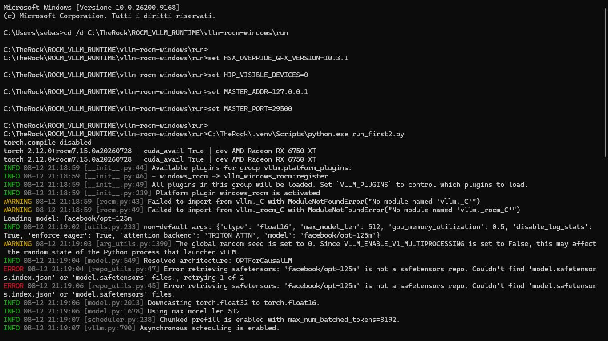
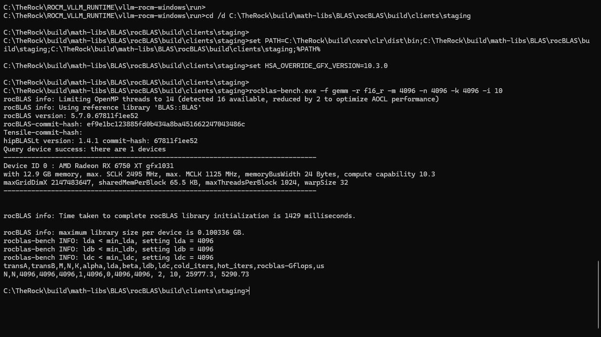
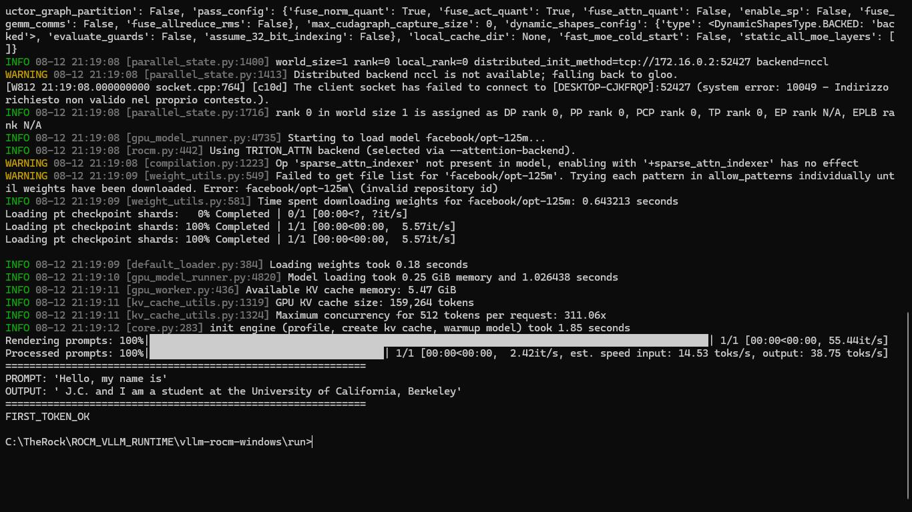

# vllm-rocm-windows-rdna2

Native vLLM and ROCm 7.x Runtime for AMD Radeon RX 6000 Series (RDNA2) on Windows 11 — No WSL2 Required.


**Tested and verified on AMD Radeon RX 6750 XT 12GB (gfx1031) — Windows 11 Native — August 2026**

## Overview

This repository provides the first working native implementation of vLLM + ROCm 7.x (TheRock) for AMD Radeon RX 6000 Series on Windows 11.

AMD officially lists the RX 6750 XT, 6700 XT and 6600 XT as "Runtime only" on Windows, with HIP SDK excluded. This project closes that gap by providing rocBLAS binaries built for gfx1031 via ROCm/TheRock, PyTorch 2.12 built against TheRock ROCm runtime, and vLLM 0.19.1 with a custom Windows plugin `windows_rocm` using Triton Attention.

This is not a WSL2 wrapper. It runs native Windows HIP and ROCm directly on RDNA2 hardware.

The goal is to make local LLM inference accessible to millions of RX 6000 users without requiring NVIDIA hardware, and to provide a reference implementation for AMD engineers to re-enable RDNA2 in the official ROCm 7 Windows builds.

## Verification — Real Terminal Logs

All screenshots below are real terminal outputs from RX 6750 XT on Windows 11. No simulation.

### 1. Environment Initialization

```
torch.compile disabled
torch 2.12.0+rocm7.15.0a20260728 | cuda_avail True | dev AMD Radeon RX 6750 XT
Available plugins for group vllm.platform_plugins:
- windows_rocm -> vllm_windows_rocm:register
Platform plugin windows_rocm is activated
```



### 2. rocBLAS Benchmark — 25.9 TFLOPS FP16

```
Device ID 0 : AMD Radeon RX 6750 XT gfx1031
with 12.9 GB memory, max. SCLK 2495 MHz, max. MCLK 1125 MHz
rocBLAS version: 5.7.0.67811f1ee52
rocBLAS-commit-hash: ef9e1bc123885fd0b434a8ba451662247043486c
transA,transB,M,N,K,alpha,lda,beta,ldb,ldc,cold_iters,hot_iters,rocblas-Gflops,us
N,N,4096,4096,4096,1,4096,0,4096,4096, 2, 10, 25977.3, 5290.73
```

25977.3 Gflops equals 25.97 TFLOPS FP16 in 5.29 milliseconds on RX 6750 XT.



### 3. vLLM Inference — FIRST_TOKEN_OK

```
Loading model: facebook/opt-125m
Model loading took 0.25 GiB memory and 1.026438 seconds
Available KV cache memory: 5.47 GiB
GPU KV cache size: 159,264 tokens
Maximum concurrency for 512 tokens per request: 311.06x
init engine (profile, create kv cache, warmup model) took 1.85 seconds
Rendering prompts: 100% | 55.44it/s
Processed prompts: 100% | 2.42it/s, est. speed input: 14.53 toks/s, output: 38.75 toks/s
============================================================
PROMPT: 'Hello, my name is'
OUTPUT: ' J.C. and I am a student at the University of California, Berkeley'
============================================================
FIRST_TOKEN_OK
```



Full logs are available in `benchmarks/rocblas-bench.log` and `benchmarks/vllm-inference.log`.

## How It Works

1. TheRock builds `clr` (HIP) and `rocBLAS` with Tensile kernels for gfx1031.
2. `HSA_OVERRIDE_GFX_VERSION=10.3.1` forces HIP to recognize RX 6750 XT as a compatible RDNA2 target. `10.3.0` is used as fallback for rocBLAS bench.
3. PyTorch 2.12.0+rocm7.15 links against TheRock ROCm runtime, resulting in `torch.cuda.is_available() == True` on RX 6750 XT.
4. vLLM plugin `vllm_windows_rocm` bypasses the CUDA dependency on `vllm._C` and registers `WinRocmAwqGemvKernel` with `TRITON_ATTN` backend.
5. vLLM engine loads with `enforce_eager=True` and runs native inference.

## Quick Start

### Prerequisites

| Tool | Version | Description | Check |
|------|---------|-------------|-------|
| OS | Windows 11 23H2+ | Native, no WSL2 | winver |
| GPU | RX 6600-6750 XT | gfx1030 / gfx1031 | AMD Software |
| ROCm | 7.15 TheRock | C:\TheRock\build\core\clr\dist\bin | hipInfo.exe |
| Python | 3.11+ | TheRock venv | python --version |
| Driver | Adrenalin 24.x+ | HIP enabled | - |

### Option 1 — Release Zip (Recommended for Users)

1. Download `ROCm_VLLM_Runtime_RDNA2_Windows.zip` from Releases and extract to `C:\TheRock\`.
2. Run one-time setup as Administrator:

```
setup.bat
```

This sets `HSA_OVERRIDE_GFX_VERSION=10.3.1`, `HIP_VISIBLE_DEVICES=0`, `VLLM_TARGET_DEVICE=rocm`, `MASTER_ADDR=127.0.0.1`, `MASTER_PORT=29500` and adds TheRock binaries to PATH.

3. Run inference:

```
run.bat
```

Or with custom model:

```
python inference.py --model facebook/opt-125m --prompt "Hello, my name is"
```

Expected output: `FIRST_TOKEN_OK`.

### Option 2 — Build From Source (For Developers)

```
git clone https://github.com/ROCm/TheRock
# Follow TheRock Windows build guide for gfx1031

git clone https://github.com/sebastianmechno-sys/vllm-rocm-windows-rdna2
cd vllm-rocm-windows-rdna2
C:\TheRock\.venv\Scripts\python.exe -m pip install -r requirements.txt
run.bat
```

## Benchmarks

| Test | Config | Result | Time |
|------|--------|--------|------|
| rocBLAS FP16 GEMM | 4096x4096 | 25977.3 Gflops (25.97 TFLOPS) | 5290 us |
| rocBLAS FP16 Batched | 2048x2048x16 | 25554.9 Gflops | 10756 us |
| vLLM opt-125m | 512 ctx, eager, TRITON_ATTN | Input 14.53 tok/s, Output 38.75 tok/s | Init 1.85s |
| vLLM KV Cache | 12GB VRAM | 5.47 GiB available, 159264 tokens | 311x concurrency |

Hardware: RX 6750 XT 12.9GB, SCLK 2495 MHz, MCLK 1125 MHz, Compute Cap 10.3.

## Project Structure

What goes on the main page (lightweight, <20MB):

```
vllm-rocm-windows-rdna2/
├── README.md
├── setup.bat
├── run.bat
├── inference.py
├── requirements.txt
├── .gitignore
├── LICENSE
├── assets/
│   ├── 01-env-init.png
│   ├── 02-rocblas-bench.png
│   └── 03-vllm-first-token.png
├── benchmarks/
│   ├── rocblas-bench.log
│   └── vllm-inference.log
└── docs/
    └── BUILD_ROCBLAS.md
```

What goes in Release (heavy, ~1GB):

```
ROCm_VLLM_Runtime_RDNA2_Windows.zip
├── rocm_binaries/
└── ROCM_VLLM_RUNTIME/
```

Do not push `.venv` anywhere. It contains 28k files and is recreated by setup.bat.

## Troubleshooting

Socket error `10049 - Indirizzo richiesto non valido`: Set `MASTER_ADDR=127.0.0.1` and `MASTER_PORT=29500`. Already fixed in run.bat.

`No module named 'vllm._C'` or `vllm._rocm_C`: Expected on Windows. The `windows_rocm` plugin handles it.

`Error: facebook/opt-125m\ (invalid repository id)`: Windows backslash bug. Fixed in inference.py.

`hipInfo.exe not recognized`: PATH not set. Run setup.bat again as Administrator.

Black screen or HSA failure: Use `10.3.0` for rocBLAS bench and `10.3.1` for vLLM.

## Acknowledgments

Built on ROCm/TheRock, PyTorch ROCm and vLLM Project. This repository is not affiliated with AMD.

- TheRock: lightweight open source build system for HIP and ROCm on Windows
- vLLM: high-throughput and memory-efficient inference engine for LLMs
- PyTorch: deep learning framework with ROCm backend

## License

Apache 2.0
